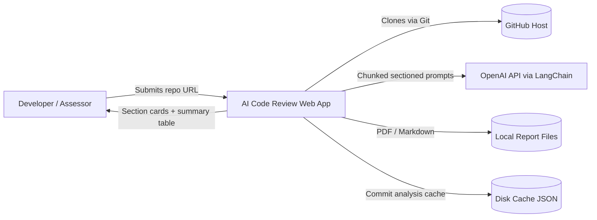
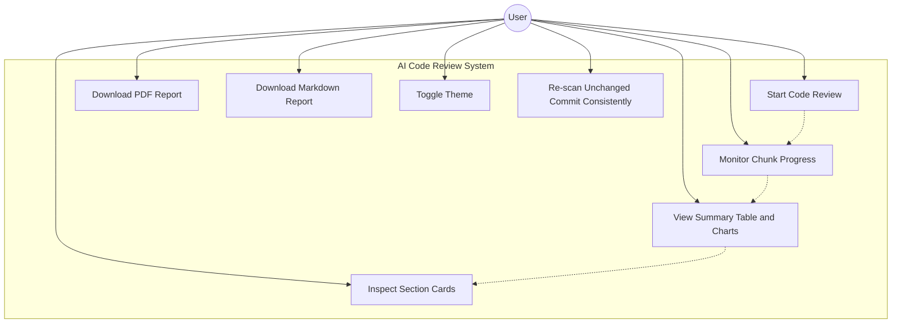
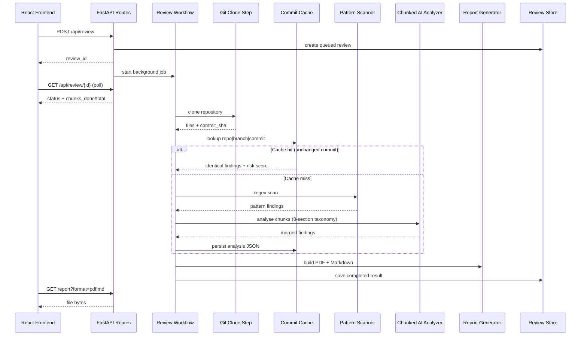
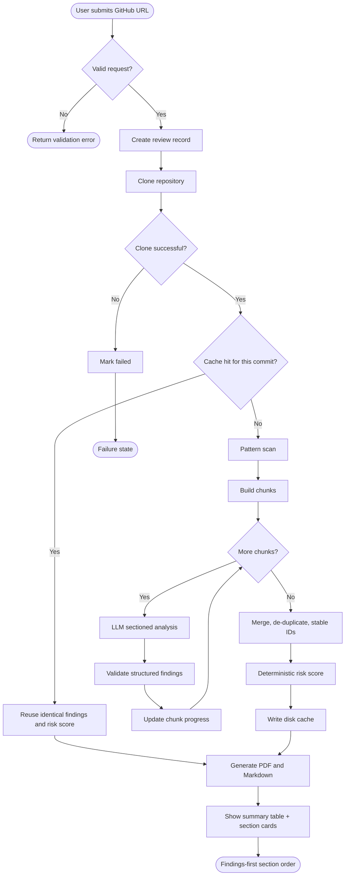
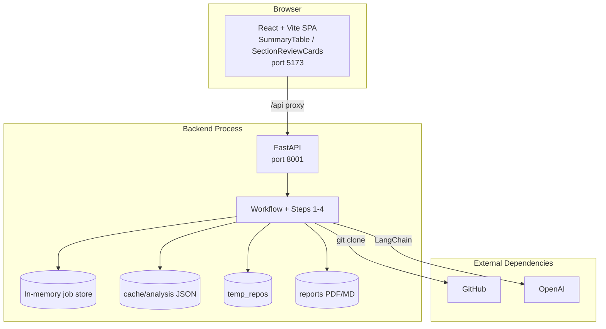
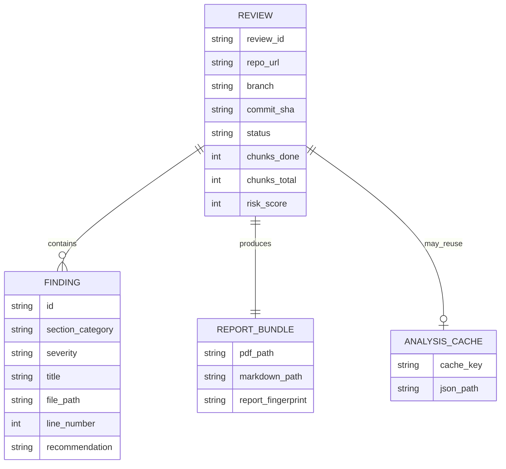

# AI Code Review: A Multi-Section Automated GitHub Code Review Framework Using Hybrid Static Analysis and Large Language Models

**Final Year Project Documentation**  
**Project Title:** AI Code Review — See Through Your Code. Secure What Matters.  
**Discipline:** Software Engineering / Computer Science  
**Document Type:** Undergraduate Project Report  

---

## Document Control

| Item | Detail |
|------|--------|
| Project Name | AI Code Review |
| Document Version | 2.0 |
| Status | Final Submission Draft (Updated Implementation) |
| Application Type | Full-stack web application |
| Backend | Python, FastAPI, LangChain, OpenAI |
| Frontend | React, TypeScript, Vite, Recharts |
| Primary Outputs | Sectioned dashboard, summary table, PDF report, Markdown report |
| Consistency Model | Commit-level memory + disk cache (no relational database required for FYP) |

---

## Abstract

Modern software teams rely on GitHub repositories as the primary source of truth for application code. Quality problems are not limited to security alone: logic defects, weak structure, performance waste, unreliable concurrency, thin tests, and poor hygiene also accumulate unnoticed when reviews are rushed or inconsistent. Manual inspection remains valuable, yet it does not scale reliably across large trees or across repeated demonstrations of the same commit.

This project presents **AI Code Review**, an automated multi-section code review platform for GitHub repositories. The system clones a target repository, applies deterministic pattern screening, analyses source content in bounded chunks with LangChain and OpenAI, and merges findings into a structured assessment. Unlike a generic chatbot session, AI Code Review organises judgement into eight fixed review sections—Correctness and Logic, Security, Readability and Maintainability, Design and Architecture, Performance and Resources, Reliability and Concurrency, Testing, and Standards and Hygiene—each rendered as its own dashboard card.

The React interface presents severity metrics, charts, a compact review-summary table, and section cards ordered so that sections with findings appear first while clear sections settle at the bottom. PDF and Markdown reports provide durable artefacts for academic assessment. Reproducibility is reinforced through temperature control, commit-seeded generation, stable finding identifiers, deterministic risk scoring, and a dual-layer analysis cache (in-memory plus on-disk) keyed by normalised repository URL, branch, and commit SHA. Consequently, re-submitting an unchanged repository yields identical findings and risk scores without requiring a full relational database for the FYP deployment.

**Keywords:** automated code review, multi-section review checklist, static analysis, large language models, LangChain, FastAPI, GitHub, risk scoring, commit cache, final year project

---

## Acknowledgements

The author acknowledges academic supervisors and peers whose feedback shaped the problem framing, evaluation criteria, and presentation structure of this project. Appreciation is also extended to the open-source communities behind FastAPI, React, LangChain, GitPython, ReportLab, and related libraries that enabled practical implementation within a constrained undergraduate timeline.

---

## Table of Contents

1. [Introduction](#1-introduction)
2. [Problem Statement](#2-problem-statement)
3. [Aims and Objectives](#3-aims-and-objectives)
4. [Scope and Limitations](#4-scope-and-limitations)
5. [Background and Related Concepts](#5-background-and-related-concepts)
6. [Requirements Analysis](#6-requirements-analysis)
7. [System Methodology](#7-system-methodology)
8. [System Design and Architecture](#8-system-design-and-architecture)
9. [Detailed Design with Diagrams](#9-detailed-design-with-diagrams)
10. [Implementation](#10-implementation)
11. [Testing and Evaluation](#11-testing-and-evaluation)
12. [Results and Discussion](#12-results-and-discussion)
13. [Ethical and Security Considerations](#13-ethical-and-security-considerations)
14. [Conclusion and Future Work](#14-conclusion-and-future-work)
15. [References](#15-references)
16. [Appendices](#16-appendices)

---

## 1. Introduction

Software repositories accumulate more than features. They also accumulate silent defects: unhandled edge cases, hardcoded secrets, oversized functions, duplicated logic, unbounded collections, fragile concurrency, shallow tests, and configuration values baked into source. Traditional peer review catches some of these issues, yet coverage depends heavily on reviewer experience, available time, and the size of the change set.

AI Code Review was designed as a university final-year solution that converts a GitHub repository URL into a structured, multi-section review briefing. It surfaces risky regions of code, groups them under professional review headings, ranks them by severity, and explains remediation in language suitable for developers and assessors.

Technically, AI Code Review is a client–server application. The browser client gathers review parameters and visualises outcomes. The Python backend executes a four-step workflow—clone, pattern scan, chunked AI analysis, and report generation—without exposing raw model chat as the end product. The delivered interface emphasises:

- a compact **review summary table** instead of long free-form executive text;
- **eight section cards**, each holding only the findings that belong to that review dimension;
- automatic ordering that places **sections with findings above clear sections**;
- **consistent scores** for unchanged commits through caching and deterministic post-processing.

This document describes the motivation, requirements, architecture, implementation, and evaluation of the completed system in a form suitable for undergraduate examination and viva defence.

---

## 2. Problem Statement

Students, startups, and small engineering teams frequently host application code on GitHub without a repeatable review process. Common gaps include:

- Security weaknesses such as secrets in source, injection risks, weak cryptography, and sensitive logging
- Correctness failures around nulls, boundaries, swallowed exceptions, and incorrect control flow
- Maintainability debt: unclear naming, oversized modules, dead code, and missing rationale comments
- Architectural friction: duplication, weak module boundaries, and tight coupling
- Performance and reliability issues that only appear under load or concurrent access
- Thin testing and incomplete project hygiene (style, docs, configuration discipline)
- Lack of a durable, printable assessment artefact for academic or organisational evidence
- Inconsistent results when the same unchanged repository is reviewed repeatedly with generative tools

Generic AI chat tools can comment on pasted snippets, but they do not autonomously clone a repository, enforce a fixed multi-section taxonomy, partition large trees into reviewable chunks, present sectioned dashboard cards, generate printable charts, or guarantee score stability for an unchanged commit. AI Code Review addresses that operational gap.

---

## 3. Aims and Objectives

### 3.1 Aim

To design, implement, and evaluate a web-based automated code review platform that analyses GitHub repositories across multiple professional review dimensions using hybrid static rules and LLM-assisted reasoning, then communicates results through a sectioned dashboard and downloadable formal reports with reproducible scoring for unchanged commits.

### 3.2 Specific Objectives

1. Accept a GitHub repository URL, optional branch name, and optional access token for private repositories.
2. Clone and inventory source files while excluding irrelevant directories such as dependency caches and build outputs.
3. Detect high-signal issues rapidly through regular-expression rules and map them into the appropriate review section.
4. Analyse repository content in bounded chunks so large trees remain within model context limits.
5. Tag every finding with exactly one of eight fixed review sections derived from a structured checklist.
6. Merge chunk-level judgements into a consolidated finding list with severity, section, location, and remediation guidance.
7. Present live progress, including chunk completion, inside a modern React interface with theme support.
8. Display a compact review-summary table of key metrics rather than lengthy free-text executive prose on the dashboard.
9. Render separate section cards for findings, with clear (empty) sections sorted to the bottom of the page.
10. Export advanced PDF and Markdown reports containing profile metadata, charts, risk posture, and prioritised findings.
11. Ensure that re-scanning the same unchanged commit returns identical findings and risk scores via dual-layer caching.

---

## 4. Scope and Limitations

### 4.1 In Scope

- Public and private GitHub repositories accessible via HTTPS cloning
- Multi-language source inspection constrained by configured extensions and size limits
- Hybrid analysis: regex screening plus OpenAI-powered review through LangChain
- Eight fixed review sections covering correctness, security, readability, design, performance, reliability, testing, and standards
- Asynchronous review lifecycle with status polling and chunk progress
- Interactive dashboard: severity pills, charts, summary table, and section cards
- PDF and Markdown report generation with embedded figures
- Commit-level consistency using in-memory and on-disk analysis caches
- Local development deployment (backend port **8001**, frontend port **5173**)

### 4.2 Out of Scope / Limitations

- AI Code Review does not replace professional penetration testing or formal certification audits.
- Findings are heuristic; LLM output may miss novel defects or overstate weak evidence.
- Analysis depth depends on file size caps, chunk settings, and available API quota.
- A full relational multi-user database is **not required** for the FYP build; disk cache provides commit memory. Enterprise multi-tenant history remains future work.
- Continuous Integration webhook automation is not part of the delivered UI.
- “Clear” on a section means no issue was detected in scanned files for that dimension—not a formal proof of absence.

---

## 5. Background and Related Concepts

### 5.1 Static Analysis

Static analysis inspects program text without executing it. Rule engines excel at spotting known anti-patterns quickly and cheaply. Their weakness is context blindness: a string matching `password` may be a true leak or a harmless fixture name.

### 5.2 Large Language Models for Code

LLMs can interpret intent, infer missing checks, and write remediation advice in natural language. Their weaknesses include variability, hallucination, and token-window constraints. AI Code Review mitigates these by fixing generation temperature to zero where possible, seeding randomness from commit identity, validating structured outputs, analysing code in chunks, and caching merged results per commit.

### 5.3 Multi-Section Review Taxonomy

Professional code review is multi-dimensional. AI Code Review therefore adopts eight sections aligned with a practical checklist:

| Section ID | Display Title | Focus of Inspection |
|------------|---------------|---------------------|
| `correctness_logic` | Correctness and Logic | Edge cases, exception handling, control flow, return contracts |
| `security` | Security | Validation, injection, auth, secrets, crypto, exposure, dependencies |
| `readability_maintainability` | Readability and Maintainability | Naming, size, complexity, dead code, comments |
| `design_architecture` | Design and Architecture | Patterns, DRY, separation of concerns, coupling |
| `performance_resources` | Performance and Resources | Inefficiencies, resource cleanup, memory growth, caching |
| `reliability_concurrency` | Reliability and Concurrency | Thread safety, idempotency, timeouts, degradation |
| `testing` | Testing | Coverage, failure paths, meaningful assertions |
| `standards_hygiene` | Standards and Hygiene | Style, documentation, API compatibility, configuration |

### 5.4 Hybrid Review Philosophy

- **Lane A (deterministic):** pattern scanner raises early, inexpensive signals (primarily security / hygiene cues).
- **Lane B (interpretive):** chunked LLM review expands coverage across all eight sections.

Both lanes feed one merge, one risk score, and one reporting layer.

### 5.5 Consistency Without a Database

For undergraduate demonstration, identical outcomes for an unchanged commit matter more than multi-user history. AI Code Review therefore uses a **commit cache** rather than a relational database:

- Cache key = normalised repository URL + branch + commit SHA
- Storage = process memory + JSON files under `backend/cache/analysis/`
- Effect = second and later scans of the same commit reuse the exact merged findings and risk score

A database would become useful only if the product needed authenticated users, long-term organisational history, or cross-machine shared state. Those needs are acknowledged as future work, not FYP blockers.

### 5.6 Why Not Only ChatGPT?

A personal chat session lacks repository cloning, folder filtering, fixed section taxonomy, progress orchestration, typed APIs, section cards, printable charts, and commit-level result locking. AI Code Review is an application system, not a prompt script.

---

## 6. Requirements Analysis

### 6.1 Functional Requirements

| ID | Requirement |
|----|-------------|
| FR-01 | The system shall accept a GitHub URL and optional branch/token. |
| FR-02 | The system shall clone the repository into a temporary workspace. |
| FR-03 | The system shall collect eligible source files under size and extension constraints. |
| FR-04 | The system shall perform pattern-based detection and map matches into review sections. |
| FR-05 | The system shall partition content into analysis chunks and invoke LLM review per chunk. |
| FR-06 | The system shall require the LLM to tag each finding with one of eight section categories. |
| FR-07 | The system shall merge and de-duplicate findings across chunks before exposing results. |
| FR-08 | The system shall expose REST endpoints for starting a review, polling status/results, and downloading reports. |
| FR-09 | The frontend shall poll progress and display messages plus chunk counters. |
| FR-10 | The dashboard shall show severity pills, charts, and a compact review-summary table. |
| FR-11 | The dashboard shall display one card per review section, listing that section’s findings. |
| FR-12 | Section cards with findings shall appear above clear (empty) section cards. |
| FR-13 | The system shall generate downloadable PDF and Markdown reports. |
| FR-14 | Re-analysis of the same commit shall return identical findings and risk score from cache when available. |

### 6.2 Non-Functional Requirements

| ID | Requirement |
|----|-------------|
| NFR-01 | Reviews shall run asynchronously without blocking the HTTP request indefinitely. |
| NFR-02 | Progress updates shall be available during long analyses. |
| NFR-03 | Generated reports shall include identifiable report metadata. |
| NFR-04 | UI shall support light and dark themes. |
| NFR-05 | Sensitive credentials shall reside in environment configuration, not source control. |
| NFR-06 | Risk score computation shall be deterministic from the final finding set. |
| NFR-07 | Cache keys shall tolerate common URL paste variants (trailing slash, `.git`, casing). |
| NFR-08 | No relational database shall be mandatory for local FYP demonstration. |

---

## 7. System Methodology

AI Code Review was developed using an iterative software engineering approach suitable for undergraduate projects:

1. **Problem framing** — identify gaps in GitHub review hygiene beyond security alone.
2. **Technology selection** — FastAPI, React, LangChain, ReportLab, Recharts.
3. **Vertical slice construction** — clone-and-scan, then AI analysis, then reporting and charts.
4. **Chunking refinement** — multi-chunk evaluation with progress feedback.
5. **Taxonomy expansion** — replace narrow security-only labels with eight review sections and checklist-driven prompts.
6. **Dashboard redesign** — summary table + section cards with findings-first ordering.
7. **Stabilisation** — temperature control, seeding, stable IDs, deterministic scoring, and dual-layer commit cache.

---

## 8. System Design and Architecture

AI Code Review follows a layered architecture:

- **Presentation Layer:** React single-page application (summary table, charts, section cards)
- **API Layer:** FastAPI routes and Pydantic contracts
- **Orchestration Layer:** review workflow service (clone → analyse or cache hit → report)
- **Analysis Layer:** pattern scan, chunk builder, LangChain/OpenAI sectioned review
- **Reporting Layer:** Markdown/PDF composers and chart images
- **State Layer:** in-memory job status/results plus on-disk commit analysis cache

Local topology: API on port **8001**, Vite on port **5173**, with `/api` proxied to the backend.

---

## 9. Detailed Design with Diagrams

This chapter presents five primary diagram styles expected in university software projects, plus a supplementary domain model.

### 9.1 Diagram Type 1 — System Context Diagram



**Interpretation:** AI Code Review mediates GitHub access, model calls, user presentation, report files, and commit memory.

---

### 9.2 Diagram Type 2 — Use Case Diagram



---

### 9.3 Diagram Type 3 — Sequence Diagram (Review with Cache Decision)



**Interpretation:** cloning always resolves the commit identity; expensive AI work is skipped when that commit was analysed before.

---

### 9.4 Diagram Type 4 — Activity / Process Flow Diagram



---

### 9.5 Diagram Type 5 — Component and Deployment Diagram



---

### 9.6 Supplementary Domain Model



---

## 10. Implementation

### 10.1 Backend Organisation

| Module | Responsibility |
|--------|----------------|
| `step1_github_clone.py` | Clone repository, resolve commit, gather source text |
| `step2_pattern_scanner.py` | Regex screening; maps matches into review sections |
| `chunk_builder.py` | Partition files into bounded analysis units |
| `step3_ai_analyzer.py` | Chunked LangChain/OpenAI analysis, merge, stable IDs, scoring |
| `step4_report_generator.py` | Advanced PDF/Markdown composition |
| `chart_renderer.py` | Severity and category chart images for PDF |
| `originality_helper.py` | Data-driven summary text and report fingerprint helpers |
| `review_workflow.py` | Orchestration, cache lookup/store, report trigger |
| `review_store.py` | Job status, results, dual-layer commit cache |
| `prompts.py` | Eight-section checklist instructions for the LLM |
| `schemas.py` | Pydantic models including section category enumeration |
| `routes.py` | REST surface for the frontend |

### 10.2 Eight-Section Analysis Strategy

The LLM system prompt enumerates the checklist items under each section and requires every finding’s `category` field to be one of:

`correctness_logic`, `security`, `readability_maintainability`, `design_architecture`, `performance_resources`, `reliability_concurrency`, `testing`, `standards_hygiene`.

Alias normalisation in the analyser maps legacy or free-text labels (for example `injection` → `security`) onto the fixed enumeration so older phrasing cannot break the dashboard cards.

### 10.3 Chunked Intelligence Strategy

1. Eligible files are packed into chunks by character and file-count budgets.
2. Each chunk is reviewed independently with the section checklist.
3. Findings are merged and de-duplicated only after all chunks finish.
4. Stable finding IDs are derived from section, severity, path, line, and title.
5. Risk score is computed deterministically from severity weights.

### 10.4 Consistency and Caching Strategy

| Mechanism | Role |
|-----------|------|
| `temperature=0` | Reduce generative drift |
| Commit + chunk seed | Encourage reproducible model draws where supported |
| Stable sort + stable IDs | Same finding set presents in the same order |
| Deterministic risk formula | Same findings ⇒ same score |
| Memory cache | Instant reuse within a running server |
| Disk cache (`backend/cache/analysis/`) | Survive restarts for the same commit |
| URL normalisation | Treat `.git`, trailing `/`, and casing variants as one repo |

**Database decision for FYP:** not required. Disk JSON cache provides sufficient commit memory for demonstration and viva consistency. A relational database remains optional future work for multi-user history.

### 10.5 Frontend Organisation

| Component | Role |
|-----------|------|
| `App.tsx` | Form, progress, results shell, theme, downloads |
| `SummaryTable.tsx` | Compact metric table replacing long executive summary text |
| `SectionReviewCards.tsx` | One card per section; findings listed inside; clear cards sorted last |
| `DashboardCharts.tsx` | Severity bars, section distribution, risk gauge |
| Theme + ambient UI | Light/dark modes with non-intrusive background motion |

Dashboard behaviour after a completed review:

1. Repository meta and download actions  
2. Severity / file count pills  
3. Charts  
4. Review summary table  
5. Review section cards (findings first, clear sections at the bottom)

### 10.6 Report Composition

PDF/Markdown artefacts remain assessment-oriented and typically include:

- Cover identity and report fingerprint  
- Repository profile  
- Embedded charts  
- Risk posture and severity/category tabulations  
- Remediation priorities  
- Methodology note  
- Findings with evidence snippets  
- Printable pagination  

### 10.7 Technology Justification

| Technology | Justification in this FYP |
|------------|---------------------------|
| FastAPI | Async-friendly API and background review jobs |
| Pydantic | Strict contracts between AI output, cache, and UI |
| LangChain | Practical LLM orchestration with structured outputs |
| OpenAI GPT model | Strong code reasoning under student budget constraints |
| GitPython / Git CLI | Reliable repository materialisation and commit identity |
| ReportLab | Programmatic PDF with figures and tables |
| React + TypeScript | Typed interactive presentation |
| Recharts | Dashboard charting |
| JSON disk cache | Commit memory without database overhead |

---

## 11. Testing and Evaluation

### 11.1 Verification Strategy

| Test Focus | Example Scenario | Expected Observation |
|------------|------------------|----------------------|
| Public repository review | Submit a known public GitHub URL | Clone succeeds; section cards and reports appear |
| Section taxonomy | Inspect findings after analysis | Each finding belongs to one of eight sections |
| Summary table | Complete a review | Metrics table appears; no long executive prose block |
| Findings-first ordering | Mixed clear and non-clear sections | Non-clear cards render above clear cards |
| Progress transparency | Long analysis | Status messages and chunk counters advance |
| Report integrity | Download PDF and Markdown | Files open with charts/sections |
| Invalid URL handling | Malformed input | Controlled failure without silent hang |
| Theme usability | Toggle light/dark | Layout remains readable |
| Consistency (same commit) | Paste unchanged repo twice | Identical finding counts and risk score via cache |
| Consistency after restart | Restart backend, re-scan same commit | Disk cache restores identical analysis |

### 11.2 Evaluation Criteria for Academic Demonstration

Examiners may judge AI Code Review against:

- Completeness of the hybrid four-step pipeline  
- Clarity of the eight-section taxonomy against the checklist  
- Quality of human-facing dashboard and printable reports  
- Evidence that chunking and caching improve practicality and consistency  
- Honest awareness of AI limitations and ethical handling of secrets  

---

## 12. Results and Discussion

AI Code Review achieves the intended undergraduate contribution: it transforms an unstructured repository into a structured, multi-section review conversation backed by dashboard and document artefacts.

Observed strengths:

- The eight-section model mirrors how professional reviewers actually think, not only how vulnerability scanners label issues.
- Chunk progress reduces black-box waiting during long analyses.
- The summary table improves scanability compared with dense narrative text.
- Section cards isolate attention; clear sections no longer dominate the top of the page.
- Commit caching makes repeated demonstrations of the same repository academically fair and visually consistent.
- Avoiding a mandatory database keeps the FYP deployable on a student workstation while still explaining how durable memory works.

Residual challenges:

- Model quality still depends on upstream API behaviour and prompt design.
- Extremely large monorepos may require stricter sampling policies.
- Disk cache is local to the machine running the backend; shared team history would need networked storage or a database later.
- “Clear” sections indicate non-detection within scanned scope, not absolute proof of quality.

Overall, the project shows that LLM assistance becomes stronger when wrapped in engineering discipline: cloning, chunking, taxonomy enforcement, schema validation, deterministic scoring, caching, and document generation.

---

## 13. Ethical and Security Considerations

- API keys must remain in local environment files excluded from Git commits.
- Private repository tokens should be treated as session secrets and never printed in reports.
- Generated findings may quote sensitive code; distribution must respect ownership and institutional policy.
- Cache files may contain finding text derived from private repositories; they should not be shared casually and are git-ignored under `backend/cache/`.
- Users should interpret LLM advice critically; AI Code Review is an assistant for review, not an absolute authority.
- Temporary clones should be cleaned after demonstrations according to local machine hygiene.

---

## 14. Conclusion and Future Work

### 14.1 Conclusion

This final-year project delivered AI Code Review, a full-stack automated GitHub code review system organised around eight professional review sections. The solution integrates deterministic pattern scanning with chunk-based LLM analysis, presents outcomes through a summary table and ordered section cards, and exports advanced printable reports. Consistency for unchanged repositories is achieved through dual-layer commit caching without requiring a relational database for the undergraduate deployment. Five diagram perspectives—context, use case, sequence, activity, and deployment/component—document how actors, processes, and modules interact. The work meets its stated aim of producing an explainable, demonstrable, and academically suitable multi-section review tool.

### 14.2 Future Work

1. Optional relational database for multi-user accounts and long-term review history  
2. Continuous Integration webhooks for pull-request reviews  
3. Differential scanning that analyses only changed commits  
4. Local or open-weight models to reduce cloud dependency  
5. SARIF export for DevSecOps toolchain interoperability  
6. Role-specific report templates for developers versus management audiences  
7. Explicit “force re-analyse” control to bypass cache when needed  

---

## 15. References

The following materials informed the conceptual and engineering basis of the project. Expand citation style (IEEE/APA/Harvard) according to departmental rules before hardbound submission.

1. Fielding, R. T. — Architectural Styles and the Design of Network-based Software Architectures (REST foundations).
2. FastAPI documentation — modern Python web APIs and dependency patterns.
3. LangChain documentation — LLM application orchestration concepts.
4. OpenAI API documentation — chat completions and structured outputs.
5. OWASP materials — application security weakness categories informing the Security section checklist.
6. Git documentation — clone operations and commit object identity.
7. React and TypeScript official guides — component-driven UI construction.
8. ReportLab user documentation — programmatic PDF generation.
9. Academic surveys on automated program analysis and AI-assisted software engineering (to be selected per institutional library access).
10. Established industrial code-review checklists covering correctness, design, performance, reliability, testing, and hygiene (adapted into AI Code Review section taxonomy).

*(Replace this outline with fully formatted bibliography entries required by your department.)*

---

## 16. Appendices

### Appendix A — Project Slogan and Product Identity

**AI Code Review**  
*See through your code. Secure what matters.*

### Appendix B — Typical Local Execution

Backend:

```bash
cd backend
python -m venv venv
# Windows: venv\Scripts\activate
pip install -r requirements.txt
python run.py
```

Frontend:

```bash
cd frontend
npm install
npm run dev
```

Open `http://localhost:5173`. Ensure `backend/.env` contains a valid OpenAI key before starting AI-backed reviews.

### Appendix C — Primary API Surface

| Method | Path | Purpose |
|--------|------|---------|
| POST | `/api/review` | Start a review job |
| GET | `/api/review/{review_id}` | Poll progress and retrieve completed result |
| GET | `/api/review/{review_id}/report?format=pdf` | Download PDF report |
| GET | `/api/review/{review_id}/report?format=md` | Download Markdown report |
| GET | `/api/health` | Health check |

### Appendix D — Review Section Checklist (Implemented Taxonomy)

1. **Correctness and Logic** — edge cases; error handling; control flow; return/side-effect contracts  
2. **Security** — validation; injection; authz/authn; secrets; unsafe paths/SSRF/deserialization; cryptography; sensitive exposure; dependency risk  
3. **Readability and Maintainability** — naming; size/single purpose; simplicity; dead/debug code; why-comments  
4. **Design and Architecture** — convention consistency; DRY; separation of concerns; coupling  
5. **Performance and Resources** — inefficiencies; resource release; unbounded growth; caching/pagination/batching  
6. **Reliability and Concurrency** — shared state/races; idempotency; timeouts and degradation  
7. **Testing** — coverage; edge/failure paths; meaningful assertions  
8. **Standards and Hygiene** — style/lint; documentation; breaking-change discipline; configuration/environment handling  

### Appendix E — Glossary

| Term | Meaning in this project |
|------|-------------------------|
| Chunk | Bounded package of source text sent to the LLM in one call |
| Finding | A structured issue with section, severity, location, and recommendation |
| Review section | One of eight fixed taxonomy categories used for cards and scoring narrative |
| Hybrid analysis | Combined regex and LLM evaluation |
| Review ID | Unique identifier for one analysis job |
| Risk score | Aggregate 0–100 indicator derived deterministically from finding severities |
| Commit cache | Memory + disk store keyed by repo/branch/commit for identical re-scans |
| Clear section | Section card with zero findings for the scanned scope |

### Appendix F — Storage Decision Note (For Examiners)

AI Code Review intentionally uses **file-backed commit caching** instead of a mandatory database in the submitted build. This choice:

- satisfies the consistency objective for unchanged repositories;
- keeps installation simple for viva demonstration;
- still allows a clear upgrade path to PostgreSQL/MySQL later for multi-user history.

### Appendix G — Declaration of Original Authorship (Suggested)

*I declare that this documentation and the AI Code Review implementation describe work performed for my final year project. Any third-party libraries, APIs, or academic sources used are acknowledged. Generated model assistance, where employed during development, was supervised and integrated into an original system design of my own.*

*(Sign and date according to university rules.)*

---

**End of Document — AI Code Review Final Year Project Documentation (Version 2.0)**
