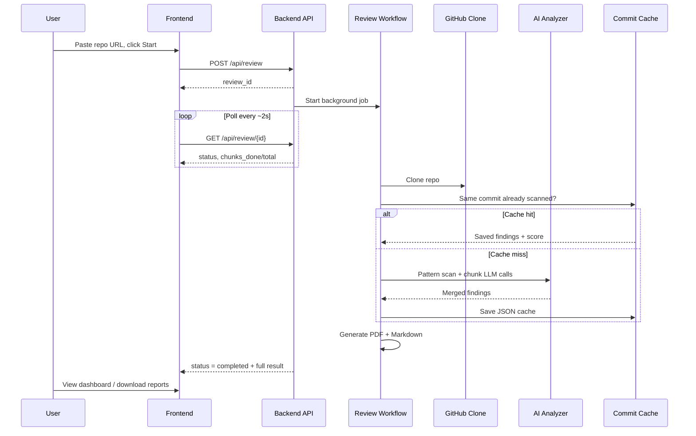

# AI Code Review — Project Structure & How It Works

**For clients and stakeholders**  
**Product:** AI Code Review — *See through your code. Secure what matters.*  
**Repository:** [github.com/farhanzafar11/Cipher-Lens](https://github.com/farhanzafar11/Cipher-Lens)

This document explains what the project contains, what each important file does, and how data flows from “paste GitHub URL” to dashboard results and downloadable reports.

---

## 1. What AI Code Review Does (In One Page)

AI Code Review is a **local web application** that:

1. Accepts a **GitHub repository URL** (and optional branch / token for private repos).
2. **Clones** the repository on the server.
3. **Scans** source code with fast pattern rules and **AI analysis** in chunks.
4. Groups every issue into **8 review sections** (Correctness, Security, Readability, Design, Performance, Reliability, Testing, Standards).
5. Shows a **dashboard** with risk score, charts, summary table, and section cards.
6. Lets the user **download PDF and Markdown** reports.
7. **Caches** results per commit so the same unchanged repo returns the **same score** on re-scan.

```
┌─────────────┐     ┌─────────────┐     ┌──────────────┐     ┌─────────────┐
│   Browser   │────▶│   Backend   │────▶│ GitHub + AI  │────▶│  Reports    │
│  (React UI) │◀────│  (FastAPI)  │◀────│  (OpenAI)    │     │ PDF / MD    │
│  :5173      │     │  :8001      │     │              │     │             │
└─────────────┘     └─────────────┘     └──────────────┘     └─────────────┘
```

**You do not need a database** for normal use. Reviews, progress, and commit cache use memory plus local JSON files under `backend/cache/` and `backend/reports/`.

---

## 2. High-Level Architecture

| Layer | Technology | Role |
|-------|------------|------|
| **Frontend** | React 18, TypeScript, Vite | Form, progress, dashboard, downloads |
| **Backend API** | FastAPI (Python) | REST endpoints, background jobs |
| **Analysis** | Regex + LangChain + OpenAI | Pattern scan + chunked AI review |
| **Reports** | ReportLab + Markdown | PDF and `.md` export |
| **Storage** | In-memory + disk cache | Job status, results, commit cache |

**Default URLs when running locally:**

| Service | URL |
|---------|-----|
| Web UI | http://localhost:5173 |
| API health | http://127.0.0.1:8001/api/health |
| API docs | http://127.0.0.1:8001/docs |

---

## 3. End-to-End Flow (How a Review Runs)



**Steps in plain language:**

| Step | Status shown | What happens |
|------|----------------|--------------|
| 1 | `queued` | Review job created |
| 2 | `cloning` | Repo cloned from GitHub; commit SHA recorded |
| 3 | `analyzing` | Pattern scan → split files into chunks → each chunk sent to AI → merge findings |
| 4 | `generating_report` | PDF and Markdown written to `backend/reports/` |
| 5 | `completed` | Full result available in UI and via API |

If the **same repo + branch + commit** was scanned before, step 3 is skipped and cached results are reused (same findings and risk score).

---

## 4. The 8 Review Sections

Every finding is tagged with **one** section. The dashboard shows **one card per section**. Sections with issues appear **first**; “Clear” sections appear at the bottom.

| # | Section ID | Display name | Examples of what is checked |
|---|------------|--------------|-----------------------------|
| 1 | `correctness_logic` | Correctness and Logic | Edge cases, errors, control flow |
| 2 | `security` | Security | Secrets, injection, auth, crypto |
| 3 | `readability_maintainability` | Readability and Maintainability | Naming, complexity, dead code |
| 4 | `design_architecture` | Design and Architecture | DRY, coupling, module boundaries |
| 5 | `performance_resources` | Performance and Resources | Inefficiency, leaks, resource cleanup |
| 6 | `reliability_concurrency` | Reliability and Concurrency | Races, idempotency, timeouts |
| 7 | `testing` | Testing | Coverage, edge-case tests |
| 8 | `standards_hygiene` | Standards and Hygiene | Style, docs, config discipline |

Section rules live in `backend/app/core/prompts.py` (AI instructions) and `backend/app/models/schemas.py` (allowed category values).

---

## 5. Risk Score (How It Is Calculated)

The **0–100 risk score** is computed on the backend in `originality_helper.py` after all findings are merged. It is **not** a simple count of issues.

- Starts from an **anchor** based on the **worst severity** present (e.g. any critical finding raises the floor).
- Adds **diminishing** points for extra findings so volume alone does not push every repo to 90+.
- Soft compression above 70 so only serious stacks approach 100.

| Score range | Typical meaning |
|-------------|-----------------|
| 0 | No findings |
| 1–24 | Low |
| 25–49 | Moderate |
| 50–74 | High |
| 75–100 | Critical |

---

## 6. Full Project Folder Tree

Below is the **meaningful** project layout (excluding `node_modules`, `venv`, generated cache, and reports).

```
AI-Code-Review/                       ← Project root
│
├── README.md                         ← Quick start for developers
├── PROJECT_OVERVIEW.md               ← This file (structure + how it works)
├── FYP_DOCUMENTATION.md              ← Full university / technical report
├── .gitignore                        ← Files never committed (secrets, cache, etc.)
│
├── start-backend.bat                 ← Windows: one-click start API
├── start-frontend.bat                ← Windows: one-click start UI
├── start-backend.sh                  ← Linux / macOS / Arch: start API
├── start-frontend.sh                 ← Linux / macOS / Arch: start UI
│
├── backend/                          ← Python API (port 8001)
│   ├── run.py                        ← Entry point: python run.py --demo
│   ├── requirements.txt              ← Python dependencies
│   ├── .env.example                  ← Template for secrets (copy to .env)
│   ├── .env                          ← YOUR keys (local only, not in Git)
│   ├── .gitignore
│   ├── BACKEND_GUIDE.md              ← Short backend explainer for presentations
│   │
│   ├── temp_repos/                   ← Temporary clones (auto-created, gitignored)
│   ├── reports/                      ← Generated PDF/MD (auto-created, gitignored)
│   ├── cache/analysis/               ← Commit cache JSON (auto-created, gitignored)
│   │
│   └── app/
│       ├── main.py                   ← Creates FastAPI app, CORS, lifespan
│       │
│       ├── api/
│       │   ├── __init__.py
│       │   └── routes.py             ← HTTP endpoints (/review, /health, report download)
│       │
│       ├── core/
│       │   ├── config.py             ← Reads .env (OpenAI key, ports, limits)
│       │   └── prompts.py            ← AI system/user prompts + 8-section checklist
│       │
│       ├── models/
│       │   └── schemas.py            ← Pydantic models (request/response/finding shapes)
│       │
│       ├── storage/
│       │   ├── __init__.py
│       │   └── review_store.py       ← Job status, results, commit cache (RAM + disk)
│       │
│       └── services/                 ← Core business logic
│           ├── review_workflow.py    ← Orchestrates entire pipeline
│           ├── step1_github_clone.py ← Clone + collect source files
│           ├── step2_pattern_scanner.py ← Regex fast scan
│           ├── chunk_builder.py      ← Split repo into LLM-sized chunks
│           ├── step3_ai_analyzer.py  ← LangChain + OpenAI per chunk, merge
│           ├── step4_report_generator.py ← PDF + Markdown reports
│           ├── chart_renderer.py     ← Charts embedded in PDF
│           └── originality_helper.py ← Risk score, summary text, report fingerprint
│
└── frontend/                         ← React UI (port 5173)
    ├── package.json                  ← npm scripts and dependencies
    ├── vite.config.ts                ← Dev server + proxy /api → :8001
    ├── index.html                    ← HTML shell, fonts, theme bootstrap
    ├── tsconfig.json
    │
    ├── public/
    │   └── shield.svg                ← Favicon / brand icon
    │
    └── src/
        ├── main.tsx                  ← React entry (mounts App)
        ├── App.tsx                   ← Main page: form, progress, results
        ├── App.css                   ← All UI styles
        ├── index.css                 ← Global CSS variables (light/dark theme)
        ├── api.ts                    ← fetch() calls to backend
        ├── types.ts                  ← TypeScript interfaces + section list
        ├── constants.ts              ← App name and tagline
        │
        ├── hooks/
        │   └── useTheme.ts           ← Light/dark theme toggle (localStorage)
        │
        └── components/
            ├── DashboardCharts.tsx   ← Severity bar, section pie, risk gauge
            ├── SummaryTable.tsx      ← Compact metrics table (not long text)
            └── SectionReviewCards.tsx ← One card per review section
```

---

## 7. File-by-File Reference

### 7.1 Root level

| File | Purpose |
|------|---------|
| `README.md` | Short install and run instructions |
| `PROJECT_OVERVIEW.md` | Client-facing structure and flow (this document) |
| `FYP_DOCUMENTATION.md` | Full academic project report with diagrams |
| `.gitignore` | Excludes `.env`, `venv`, `node_modules`, cache, reports |
| `start-backend.bat` / `.sh` | Creates venv if needed, installs deps, runs API in demo mode |
| `start-frontend.bat` / `.sh` | Runs `npm install` if needed, starts Vite dev server |

### 7.2 Backend — entry & config

| File | Purpose |
|------|---------|
| `backend/run.py` | Starts Uvicorn on port 8001; supports `--demo` (no auto-reload) |
| `backend/requirements.txt` | Python packages: FastAPI, LangChain, OpenAI, GitPython, ReportLab, etc. |
| `backend/.env.example` | Template: `OPENAI_API_KEY`, `APP_ENV`, scan limits |
| `backend/.env` | **Local secrets** — must be created by each user; never committed |

### 7.3 Backend — `app/main.py`

Creates the FastAPI application:

- Registers CORS (allows frontend on localhost)
- Creates folders on startup: `temp_repos`, `reports`, `cache`
- Mounts API router at `/api`
- Root `/` returns app name, version, health link

### 7.4 Backend — `app/api/routes.py`

| Method | Path | Purpose |
|--------|------|---------|
| `POST` | `/api/review` | Start a new review (returns `review_id` immediately) |
| `GET` | `/api/review/{review_id}` | Poll status; when complete, includes full `result` |
| `GET` | `/api/review/{review_id}/report?format=pdf\|md` | Download report file |
| `GET` | `/api/health` | Health check + OpenAI configured flag |

The review runs in a **background task** so the browser is not blocked.

### 7.5 Backend — `app/core/config.py`

Loads settings from `.env`:

- `OPENAI_API_KEY`, `OPENAI_MODEL`
- `APP_ENV`, `APP_PORT`, reload behaviour
- `MAX_FILES_TO_SCAN`, `MAX_FILE_SIZE_KB`
- `CHUNK_MAX_CHARS`, `CHUNK_MAX_FILES` (how big each AI chunk is)
- `CORS_ORIGINS`

### 7.6 Backend — `app/core/prompts.py`

Contains the **AI instructions**:

- Lists all 8 review sections and checklist items
- Tells the model to tag each finding with exactly one section
- Chunk-aware wording (`chunk X of Y`)

### 7.7 Backend — `app/models/schemas.py`

Defines data shapes used across API and services:

| Model | Meaning |
|-------|---------|
| `ReviewRequest` | Input: repo URL, branch, optional GitHub token |
| `ReviewStatusResponse` | Output while polling: status, message, chunk progress, optional result |
| `SecurityFinding` | One issue: section, severity, title, file, line, recommendation |
| `ReviewSummary` | Counts by severity, risk score, executive summary text (for reports) |
| `CodeReviewResult` | Complete review payload sent to frontend |
| `FindingCategory` | Enum of the 8 section IDs |

### 7.8 Backend — `app/storage/review_store.py`

| Store | Purpose |
|-------|---------|
| `review_status` | In-memory map: progress messages, `chunks_done` / `chunks_total` |
| `review_results` | In-memory map: final `CodeReviewResult` per `review_id` |
| `analysis_cache` | Memory + `cache/analysis/*.json` keyed by repo + branch + commit |

**Cache key** normalises URL (lowercase, strips `.git`, trailing slash) so paste variants still match.

### 7.9 Backend — services (the pipeline)

#### `review_workflow.py` — **Orchestrator**

The single function `run_full_review()` ties everything together:

1. Clone  
2. Check commit cache  
3. If miss → run `analyze_repository()`  
4. Save cache  
5. Generate reports  
6. Save result and mark completed  
7. Always delete temp clone in `finally`

#### `step1_github_clone.py` — **Step 1: Clone**

- Clones via GitPython
- Skips folders like `node_modules`, `.git`, `venv`
- Collects files with known code extensions
- Respects max file count and size from config
- Returns `ClonedRepo` with path, commit SHA, repo name

#### `step2_pattern_scanner.py` — **Step 2: Pattern scan**

- Runs **regex** over each line (no AI cost)
- Detects patterns such as hardcoded secrets, `eval`, weak crypto, debug logs
- Maps hits to review sections (mostly **Security** or **Readability**)
- Produces finding dicts merged later with AI findings

#### `chunk_builder.py` — **Chunking**

- Splits collected files into packs that fit token/character limits
- Each chunk knows: index, total, file list, formatted source text
- Pattern findings can be filtered per chunk for AI context

#### `step3_ai_analyzer.py` — **Step 3: AI analysis**

- Runs pattern scan on full repo
- For each chunk: calls OpenAI via LangChain with structured JSON output
- Uses `temperature=0` and commit-based seed for consistency
- Merges pattern + AI findings, de-duplicates, assigns stable finding IDs
- Computes risk score via `originality_helper.py`
- Builds executive summary for reports

#### `step4_report_generator.py` — **Step 4: Reports**

- Builds rich **PDF** (ReportLab): tables, charts, findings by severity
- Builds matching **Markdown**
- Saves under `backend/reports/{repo_name}_{review_id}.pdf|.md`

#### `chart_renderer.py`

- Draws bar/pie/gauge charts as ReportLab graphics for PDF export

#### `originality_helper.py`

- **`calculate_risk_score_from_findings()`** — balanced 0–100 score  
- **`merge_executive_summary()`** — data-driven summary for PDF/MD  
- **`sort_findings_stably()`** — consistent ordering  
- **`generate_report_fingerprint()`** — unique report ID  

### 7.10 Frontend files

| File | Purpose |
|------|---------|
| `main.tsx` | Renders `<App />` into the page |
| `App.tsx` | Full UI: navbar, form, progress, results, theme toggle |
| `api.ts` | `startReview`, `getReviewStatus`, `pollReview`, report URLs |
| `types.ts` | TypeScript types mirroring backend models + `REVIEW_SECTIONS` list |
| `constants.ts` | `APP_NAME`, `APP_TAGLINE` |
| `hooks/useTheme.ts` | Persists light/dark in `localStorage` |
| `components/DashboardCharts.tsx` | Recharts: severity bars, section distribution, risk gauge |
| `components/SummaryTable.tsx` | Table of repo metrics (not long prose) |
| `components/SectionReviewCards.tsx` | 8 section cards; sorts findings-first |
| `App.css` / `index.css` | Layout, glass cards, tables, section cards, theme tokens |
| `vite.config.ts` | Dev server port 5173; proxies `/api` to backend 8001 |

---

## 8. API ↔ Frontend Communication

```
Frontend                          Backend
────────                          ───────
POST /api/review          ───▶    Creates review_id, starts background job
GET  /api/review/{id}     ◀───    Poll until status = completed
                                  (includes chunks_done, chunks_total)
GET  /api/review/{id}/report      Download PDF or Markdown
```

Polling interval: about **2 seconds** (see `api.ts` → `pollReview`).

---

## 9. What Gets Created on Disk (Runtime)

These folders are **automatic** and **not** in Git:

| Path | Contents |
|------|----------|
| `backend/temp_repos/` | Short-lived Git clones (deleted after each review) |
| `backend/reports/` | PDF and Markdown reports |
| `backend/cache/analysis/` | JSON cache per commit (consistent re-scans) |
| `backend/venv/` | Python virtual environment |
| `frontend/node_modules/` | npm packages |

---

## 10. Configuration Cheat Sheet

Copy `backend/.env.example` → `backend/.env`:

| Variable | Required | Meaning |
|----------|----------|---------|
| `OPENAI_API_KEY` | Yes (for full AI) | OpenAI API key |
| `OPENAI_MODEL` | No | Default `gpt-4o-mini` |
| `APP_ENV` | No | `demo` recommended for presentations |
| `APP_PORT` | No | Default `8001` |
| `MAX_FILES_TO_SCAN` | No | Cap files per repo (default 50) |
| `CHUNK_MAX_CHARS` | No | Max characters per AI chunk |
| `CHUNK_MAX_FILES` | No | Max files per AI chunk |

---

## 11. Technology Stack Summary

| Area | Choices |
|------|---------|
| Backend framework | FastAPI |
| AI orchestration | LangChain |
| LLM provider | OpenAI (configurable model) |
| Git operations | GitPython |
| PDF generation | ReportLab |
| Frontend | React 18 + TypeScript |
| Build tool | Vite |
| Charts (UI) | Recharts |
| Validation | Pydantic (backend), TypeScript (frontend) |

---

## 12. Security Notes for Clients

- **Never commit** `backend/.env` — it contains the OpenAI key.
- Private repo tokens are sent to the backend for cloning only; treat them as secrets.
- Cloned code and AI chunks may be sent to **OpenAI** when the key is configured.
- Cache and report files may contain code snippets from scanned repositories — handle accordingly.

---

## 13. Quick Demo Checklist

Before showing AI Code Review to a client:

1. [ ] `backend/.env` has a valid `OPENAI_API_KEY`
2. [ ] Backend running → http://127.0.0.1:8001/api/health shows `"status": "healthy"`
3. [ ] Frontend running → http://localhost:5173 loads
4. [ ] One public GitHub URL prepared for live demo
5. [ ] PDF download tested once

---

## 14. Where to Read More

| Document | Audience | Content |
|----------|----------|---------|
| `README.md` | Developer | Quick install |
| `PROJECT_OVERVIEW.md` | **Client / stakeholder** | Structure + flow (this file) |
| `FYP_DOCUMENTATION.md` | University | Full report, diagrams, methodology |
| `backend/BACKEND_GUIDE.md` | Presenter | Backend steps for viva/demo |

---

## 15. Glossary

| Term | Meaning |
|------|---------|
| **Review ID** | UUID for one scan job |
| **Commit SHA** | Exact Git commit analysed; used for cache |
| **Chunk** | Subset of files sent to AI in one request |
| **Finding** | One reported issue with section + severity |
| **Risk score** | 0–100 summary derived from findings |
| **Section card** | UI block for one of the 8 review categories |
| **Hybrid analysis** | Regex pattern scan + AI review combined |

---

*AI Code Review v2 — Project overview for clients and technical stakeholders.*
